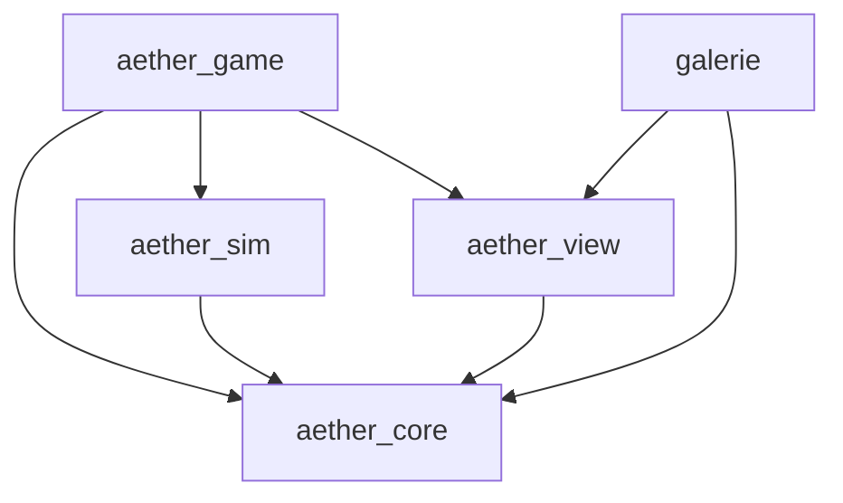

# Architecture du reboot

Le domaine possède les données et leurs invariants. Avian possède les poses physiques. Le renderer transforme des snapshots en images. `game` compose ces responsabilités et les interfaces de stockage. Aucun mesh ou identifiant d'entité Bevy n'est une sauvegarde autoritaire.

## Contrats

`Body` encapsule une grille sparse de chunks denses 16³. Une cellule représente 0,5 m et son adresse désigne son centre. La division euclidienne évite les erreurs aux coordonnées négatives. L'ordre d'export est stable. Les commandes construisent une proposition, valident toutes les cellules et composants, puis changent la révision. Un refus ne publie aucune partie de la proposition.

Les IDs de corps et composants sont persistants, distincts des `Entity`. Les limites sont vérifiées avant la création des chunks. Les composants ont un support, une orientation par quart de tour, une empreinte et une masse. Le centre de masse et le tenseur d'inertie incluent volumes propres, rotation des composants et théorème des axes parallèles.

La scission utilise un parcours exact du voisinage à six faces. Les coordonnées locales restent inchangées. Le fragment contenant le poste conserve l'identité principale ; sinon le plus grand est retenu. Les composants restent avec leur support, la réserve suit les capacités, le câble est libéré. La vitesse de chaque centre est celle d'un corps rigide, `v + ω × décalage`. Les fragments restent immobiles au quai, ce qui borne le changement de topologie.

## Ordre de simulation

Le rendu collecte les commandes dans `Update`. `Time<Fixed>` avance à 60 Hz. Avian s'exécute en `FixedPostUpdate` ; le système de forces se place après `PhysicsSystems::Prepare` et avant `StepSimulation`. Tnua et son adaptateur partagent `PhysicsSchedule`, où ses capteurs et son contrôle sont ordonnés. Le compteur physique avance après `PhysicsSystems::Last`. Aucun deuxième intégrateur ne modifie le navire.

`Time<Virtual>` est suspendu dans les menus, la pause et en perte de focus. Le rattrapage est borné à 0,1 seconde. Le benchmark explicite continue hors focus pour mesurer une simulation réelle. La caméra amortit en secondes à partir de poses rendues ; elle ne corrige jamais une pose physique.

Les colliders voxel Parry utilisent des coins de cellule. Leur entité enfant a donc un décalage de −0,25 m sur les trois axes. La racine conserve l'origine du domaine et les propriétés de masse calculées ; la densité des enfants est nulle pour éviter un double comptage. Les équipements solides ont des colliders simples ; la toile laisse passer le personnage, le mât reste solide. Le terrain utilise les mêmes boîtes pour l'image, les collisions et l'intersection du câble.

Tnua reçoit une vitesse désirée. Sur un support mobile, une correction bornée à 1 m/s maintient le point local lors de l'immobilité au sol. Elle s'efface à la marche, au saut ou à la perte de support. Elle ne téléporte pas le personnage. Le test de translation à 5 m/s et rotation à 30°/s mesure moins de 5 cm de dérive relative sur 30 secondes.

## Rendu et travaux différés

Le greedy construit un masque par tranche et par matériau, avec lecture des voisins de chunks. Un voisin en verre ne masque pas une face opaque. Les UV sont des coordonnées locales continues, donc une coque translatée ou tournée ne fait pas glisser ses textures. Le renderer partage ses matériaux avec la galerie ; il produit aussi les tangentes nécessaires au PBR.

La file est dédoublonnée par corps et chunk. Les requêtes contiennent une copie immuable et une révision. Un résultat périmé est ignoré et la dernière révision est réclamée. Quatre jobs au plus tournent en natif. Le web effectue des masques de 16×16, avec un budget coopératif de 1,5 ms entre masques ; aucune dépendance aux workers ou à la mémoire partagée. Ce budget ne constitue pas une mesure du temps GPU d'upload.

Les entités de session et d'environnement sont supprimées lors d'un remplacement. Les meshes libèrent leurs handles avec leurs entités ; les matériaux, polices et animations partagés restent chargés. Les tests de cycles vérifient les propriétaires et l'absence de multiplication des caméras.

Les capteurs de proximité Tnua sont explicitement enfants de leur `Walker` pour leur durée de vie. La relation Tnua seule ne cascade pas la destruction dans la version résolue. Ces entités sans Transform gardent leur repère de détection Tnua ; le parentage Bevy assure uniquement leur suppression avec le personnage. Vingt allers-retours marche/pilotage sont protégés par une régression dédiée.

## Présentation et mesures de fermeture

Les racines physiques portent explicitement `TransformInterpolation`. Les décisions d'accrochage et d'embarquement utilisent `Position`/`Rotation` ; la caméra suit le `Transform` interpolé. `teleport_pose` remet aussi à zéro les états de lissage. La tolérance des repères affichés couvre un tick physique, avec un test à 120 Hz qui constate effectivement un retard non nul.

La file privilégie le corps édité, puis les chunks proches de la caméra. Une mutation annonce immédiatement une préparation, avant le prochain passage du mesher : quitter le quai ne peut plus lire la file vide de la session précédente. Le test d'ordonnancement injecte les réponses fraîche puis obsolète dans le vrai consommateur.

`tools/art/scene.json` est exporté du terrain Rust. Blender construit les dix GLB à partir de ce manifeste ; les empreintes du manifeste et du générateur sont insérées dans chaque fichier et vérifiées. Les chanfreins, strates et petites pousses sont décoratifs. Les volumes des îles, ruines et observatoire restent ceux du domaine. Les boîtes coplanaires adjacentes sont regroupées pour Avian sans changer leur union ; le picking du câble conserve la géométrie détaillée.

Le renderer commun fournit HDR, SSAO, TAA, bloom et une sonde d'environnement atmosphérique de 64² pixels par face. Le panorama forme le lointain ; les nuages proches sont six volumes échantillonnant une texture 64³ avec auto-ombrage et arrêt sur la profondeur opaque. Le maillage des bordages, ferrures, fenêtres et cordages suit les cellules occupées ; le coût des détails est plafonné à 1024 cellules par coque, sans limiter les cellules visibles ou physiques. Les GLB essentiels participent à la barrière de chargement. Le personnage est optionnel : sa représentation de secours reste jouable si Knight est absent.

Les diagnostics distinguent entités réellement présentes et indices d'entité alloués par Bevy. Les vingt cycles natifs contrôlent le premier compteur, les handles et les files ; l'endurance rendue les relève également avec la mémoire linéaire WASM. Les passes GPU ne sont rapportées que si des horodatages sont effectivement reçus.

Les PNG non compressés reçoivent leurs mipmaps au chargement, une seule fois par image. La réduction des couleurs sRGB se fait en lumière linéaire ; les textures linéaires restent linéaires, y compris leurs canaux alpha. Les dimensions impaires incluent la dernière ligne et colonne. Filtrage trilinéaire et anisotropie 8 limitent le scintillement de la toile et du bois sans modifier les images sources.

Seules les images chargées depuis un chemin d'asset sont concernées. Les atlas de glyphes et les cibles de rendu créés dynamiquement restent sous la responsabilité de leur propriétaire ; un test vérifie qu'un atlas RGBA sRGB garde son unique niveau modifiable.

## Stockage et distribution

La présentation de la voile reçoit le vent apparent via `SailWind`, composant de `view` alimenté par `game`. Ses trois morph targets GPU déforment la toile et l'emblème sans reconstruire les meshes. `core::fields` fournit le même vent semé et borné à la physique et à cette adaptation visuelle. La phase provient du tick de simulation ; pause et reprise ne lancent pas une horloge décorative indépendante.

Une session est validée avant destruction de la précédente. Les corps sont créés avant les joints et le personnage. Les intentions repartent à zéro. Les écritures sont sérialisées par un état `pending` ; les opérations changeant l'identité ou la construction attendent leur fin.

Windows écrit un temporaire dans le même dossier, synchronise son contenu et remplace le fichier. La copie précédente n'est mise à jour que si elle se décode. IndexedDB conserve sauvegarde et backup dans une transaction `strict` et annonce le succès à `oncomplete`. Ces garanties ne remplacent pas une sauvegarde externe face à une panne matérielle ou à l'effacement volontaire des données du navigateur.

Le package web garde JS, WASM et assets sous un répertoire d'empreinte unique. La page d'entrée redirige vers ce répertoire et n'est pas mise en cache. Les versions anciennes peuvent rester présentes. Le format de session V3 lit et migre V1/V2, sans leur ajouter automatiquement un circuit ; les lecteurs antérieurs refusent V3. Un retour au binaire ancien exige donc une sauvegarde ancienne conservée séparément. Le package natif résout ses assets à côté de l'exécutable ; aucun chemin absolu de compilation n'y est requis.

Le Blueprint porte seulement le plan optionnel du circuit : IDs des véritables équipements, ports et vannes. L'état de simulation porte les milli-unités, compteurs fractionnaires de débit et fuites ; la validation exige la concordance de la topologie et du miroir de réserve. Les branches connectées partagent un stockage borné. Demandes simultanées, changements de capacité, coupures et séparations utilisent des allocations entières déterministes. L'historique ne conserve aucune quantité ; l'annulation de flotte conserve le plafond actuel de réserve. Le portail débite également cet état autoritaire, avant tout changement de pose. Le routage spatial possède désormais une fondation pure et bornée dans `core::conduit_route`, sans appel en jeu. Les poses réelles de raccords, la pose de modules, les collisions, les pompes commandables et les dommages restent à intégrer ; voir [CONDUITES](CONDUITES.md).

## Monde ouvert 0.2

`core::world` définit les centres des neuf régions, les ports et les routes ; les 204 îles supplémentaires ont des IDs stables. Les trois ports historiques gardent leurs IDs. Les douze modèles d'îles exportent leurs volumes, passages et repères d'eau/cristaux depuis Blender. `world_geometry` lit ces contrats pour les tests, la visibilité des interactions et les collisions. Le LOD retire les petits détails sans creuser les surfaces praticables. La voûte possède deux entrées latérales et deux puits ouverts ; les deux régions souterraines sont situées à −1400 et −2200 m.

`sim` charge les collisions proches par groupes de deux îles et conserve une marge au déchargement ; l'arrivée d'un portail prépare immédiatement son terrain. `view` gère indépendamment les scènes proches et leurs LOD. Les courants utilisent une même polyligne dans la physique, la carte et le rendu. Le lissage Catmull-Rom est refusé localement s'il traverse un obstacle ; le segment sûr est alors conservé. Les courants n'imposent pas une vitesse : ils appliquent des forces et peuvent être quittés.

Les moteurs font partie de la construction, consomment la réserve et contribuent à la masse. La poussée diminue progressivement avec la vitesse ; elle reste utilisable face au vent. Le frein est un amortissement supplémentaire et la marche arrière est limitée par sa propre courbe. La cargaison persistante ajoute sa masse et son inertie au corps principal ; elle ne flotte pas dans une donnée d'interface sans effet physique.

`Expedition` porte découvertes, destination, crédits, cargaison, contrats, ressources déjà récoltées et espèces observées. Les actions valident distance, visibilité, capacité et réserve avant mutation. Les emplacements de collecte sont indexés par île et slot stable. Les portails exigent un lieu déjà visité, de l'énergie et un délai ; ils remettent à zéro vitesses et interpolation. Les résidents et les cinq navires marchands tirent leurs poses du tick sauvegardé ; pause et reprise conservent leur phase. Les machines et hélices visuelles reçoivent cette même horloge via la présentation.

La caméra suit une pose interpolée et réalise un balayage sphérique vers sa position souhaitée. Elle se rapproche immédiatement devant une paroi et reprend progressivement sa distance. Elle ne déplace jamais le navire pour résoudre une occlusion.
