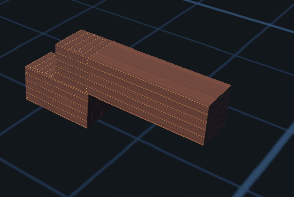
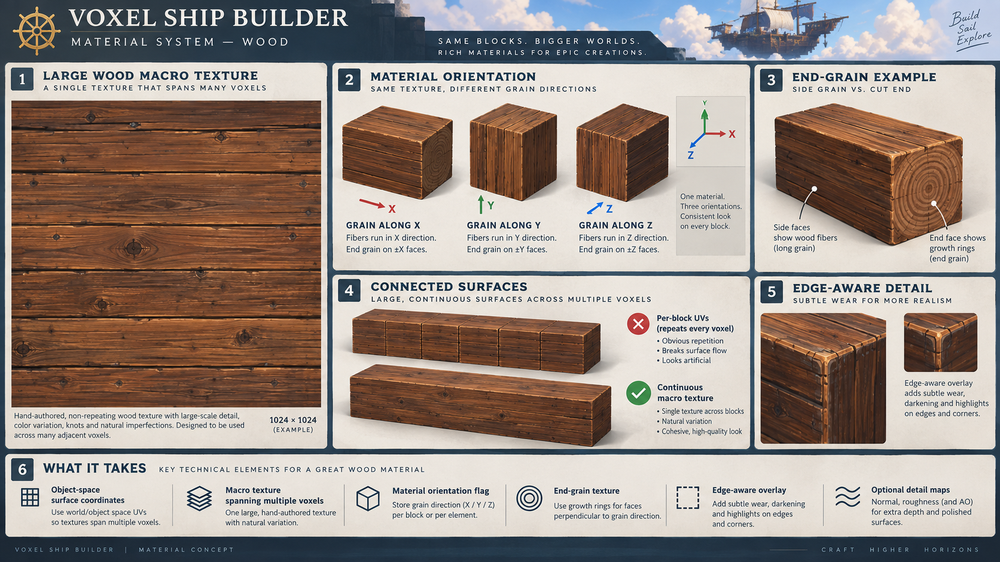

# Voxel Shading Brainstorming


Here is the chatGPT session about our voxels shading exploration.


## Chat

Me:
I planning on doing a voxel based game.
Its a world of floating islands each island is a separate voxel entity. Players can travel between them and build ships using voxels too.
Only cube voxels.

So no infinite continuous voxel system.
Each voxel entity can have a bouding box. This greatly simplify performance optimisations.
The game is made using rust and bevy.
The rendering details is similar of space engineers but without smooth voxels.
That means its mostly cubes and some voxels can have some more complexe geometries.

I don't want to build my own voxel engine if I can avoid it.

Help me do some reseach and find a good voxel engine.
The voxel engine must be use by at least on published game.
I don't want microvoxel engine like teardown.
If multiple games are running on it its a plus.

I planning on doing a voxel based game.
Its a world of floating islands each island is a separate voxel entity. Players can travel between them and build ships using voxels too.
Only cube voxels.

So no infinite continuous voxel system.
Each voxel entity can have a bouding box. This greatly simplify performance optimisations.
The game is made using rust and bevy.
The rendering details is similar of space engineers but without smooth voxels.
That means its mostly cubes and some voxels can have some more complexe geometries.

I don't want to build my own voxel engine if I can avoid it.

Help me do some reseach and find a good voxel engine.
The voxel engine must be use by at least on published game.
I don't want microvoxel engine like teardown.
If multiple games are running on it its a plus.


ChatGPT:
I researched this with your architecture in mind rather than treating it as a generic “Minecraft voxel engine” problem.

The main conclusion is: **there isn't currently a mature, Bevy-native voxel engine with strong commercial-game pedigree that perfectly matches your model.** But there are a few serious candidates, and one approach stands out.

## What your voxel engine actually needs

Your architecture is unusually favorable for voxels:

```text
Bevy World
│
├── Island Entity
│   ├── Transform
│   ├── BoundingBox
│   └── VoxelBody
│       ├── Chunk
│       ├── Chunk
│       └── Chunk
│
├── Island Entity
│   └── VoxelBody
│
└── Ship Entity
    ├── Transform / Physics
    └── VoxelBody
        ├── Chunk
        └── Chunk
```

The important thing is that **voxel coordinates should be local to the island/ship**, not global.

That gives you some very useful properties:

* entire islands can be culled by their bounding box;
* far-away islands don't need any chunks loaded at all;
* a ship can translate/rotate without rebuilding its voxel meshes;
* collision/raycast queries can transform into the voxel body's local space;
* you don't need complicated infinite-world addressing;
* each voxel body can have independent storage, dirty chunks and mesh jobs;
* chunk coordinates can remain small;
* islands and ships can use exactly the same underlying voxel representation.

That last point matters a lot when evaluating libraries.

---

# The shortlist

| Engine/library             | Bevy/Rust         | Separate moving voxel bodies | Cubes | Custom block geometry | Proven use                             | State                   | My rating |
| -------------------------- | ----------------- | ---------------------------: | ----: | --------------------: | -------------------------------------- | ----------------------- | --------: |
| **Voxelize core + mesher** | 🟢 Rust           |     🟢 With thin integration |    🟢 |          🟢 Excellent | **Town**, live production world        | 🟢 Active, 3.0 Aug 2026 |     ⭐⭐⭐⭐⭐ |
| **bevy_voxel_world**       | 🟢 Native Bevy    |                   🟠 Awkward |    🟢 |      🟢 Custom mesher | **RTFE**, released itch game           | 🟢 Active               |      ⭐⭐⭐⭐ |
| **PolyVox**                | 🔴 C++            |                🟢 Good model |    🟢 |                    🟢 | **Voxeliens**, several historical uses | 🔴 Unmaintained         |       ⭐⭐⭐ |
| **Voxel Farm**             | 🔴 C++ middleware |                  🟠 Possible |    🟢 |       🟢 Very capable | **Landmark**                           | 🟢 Commercial           |       ⭐⭐½ |

My first thing to investigate further would be **Voxelize's Rust meshing components**, rather than adopting the entire Voxelize engine.

---

# 1. Voxelize — the most interesting discovery

This one is much more interesting for your project than I initially expected.

Voxelize is a current open-source voxel engine with a Rust authoritative server and a TypeScript/Three.js client. Version **3.0.0 was released August 3, 2026**, so it is actively maintained. Its own documentation says its live persistent multiplayer world **Town** is running Voxelize in production. It supports blocks of arbitrary shape, size and material. ([Docs.rs][1])

The full engine isn't what I would use, though.

### The interesting part is `voxelize-mesher`

They have separated the voxel meshing engine into a standalone Rust crate:

```text
voxelize-core
      │
      ▼
voxelize-mesher
      │
      ├── native Rust server
      │
      └── WASM browser client
```

And importantly, the mesher does **not** require Voxelize's complete world implementation.

It operates through a generic:

```rust
VoxelAccess
```

trait.

The crate contains:

* greedy meshing;
* face culling;
* ambient occlusion;
* voxel lighting handling;
* block geometry;
* registry/types;
* the actual chunk meshing algorithms.

Its only main dependencies are `hashbrown`, `serde`, and `voxelize-core`. ([Docs.rs][2])

That's very attractive for Bevy.

### I would use it something like this

Conceptually:

```rust
#[derive(Component)]
struct VoxelBody {
    storage: VoxelStorage,
    bounds: IVec3,
}

#[derive(Component)]
struct VoxelChunk {
    body: Entity,
    coord: IVec3,
}
```

Then make your storage implement something conceptually equivalent to:

```rust
impl VoxelAccess for VoxelBodyStorage {
    ...
}
```

and feed it to the Voxelize mesher.

The resulting geometry gets converted into:

```rust
bevy::render::mesh::Mesh
```

You don't adopt its Three.js client, its networking stack, or its global world architecture.

You essentially steal the **battle-tested voxel core**.

### Complex blocks are particularly interesting

Voxelize explicitly supports custom blocks of arbitrary shapes, sizes and materials. ([Docs.rs][3])

That's exactly what you described.

For example:

```text
basic hull
████████
████████

stairs
████
  ████

angled hull
   ██
 ████
██████

engine
┌─────────┐
│ complex │
│  mesh   │
└─────────┘
```

You can still have a grid cell/block ID:

```rust
enum Block {
    Air,
    Hull,
    Wood,
    Glass,
    Stair,
    Slope,
    Engine,
    Propeller,
}
```

without demanding that every block render as a cube.

This is basically the **Space Engineers block model** rather than a microvoxel model.

### The catch

I would **not adopt the complete Voxelize world engine**.

It's fundamentally designed around persistent multiplayer worlds and browser clients. ([Docs.rs][3])

You don't need much of that.

For Aether, I'd treat:

```text
Voxelize
┌──────────────────────────────┐
│ Networking             ❌    │
│ Web client             ❌    │
│ Three.js renderer      ❌    │
│ World/server model     ❌    │
│ Physics                maybe │
│ Block registry         ✅    │
│ Voxel core             ✅    │
│ Meshing                ✅    │
│ Geometry definitions   ✅    │
└──────────────────────────────┘
```

as a source of reusable subsystems.

### Published-game criterion

There's one caveat to your criterion.

**Town is explicitly described by its developers as a live production multiplayer building world**, so there is genuine production use. ([Docs.rs][1])

But it isn't the same level of validation as “this library shipped a Steam game with 100,000 users.”

So I'd rate its pedigree:

**production proven, but not yet heavily game-industry proven.**

---

# 2. `bevy_voxel_world`

This is the obvious Bevy choice.

And it's surprisingly mature now.

It currently supports Bevy **0.19** through `bevy_voxel_world 0.17`, and provides multithreaded meshing, chunk spawning/despawning, voxel modification, textures, LOD and configurable meshing. ([GitHub][4])

It has also actually been used in at least one released game.

**RTFE**, a downloadable Windows/Linux Bevy Jam game, explicitly lists `bevy_voxel_world` among its dependencies and is marked Released on itch.io. ([itch.io][5])

So technically it passes your requirement.

But there is an architectural problem.

## Its idea of multiple voxel worlds isn't yours

In `bevy_voxel_world`, a configuration **type** identifies the voxel world:

```rust
VoxelWorld<MyWorld>
```

The docs explicitly explain that multiple worlds require multiple unique configuration struct types. ([Docs.rs][6])

So something like:

```rust
struct IslandA;
struct IslandB;
struct IslandC;
```

works.

But you want:

```text
Entity 4829 → VoxelBody
Entity 5182 → VoxelBody
Entity 8001 → VoxelBody
Entity 8002 → VoxelBody
...
```

created dynamically at runtime.

That is a very different model.

The library can parent chunks to a root entity, so an entire voxel world can be translated or hidden together. ([Docs.rs][7])

That makes this:

```text
one moving voxel world
```

possible.

But it doesn't solve:

```text
arbitrary number of runtime voxel bodies
```

cleanly.

### This matters particularly for ships

Imagine:

```text
50 islands
+
200 player ships
+
40 wrecks
+
25 NPC ships
```

You definitely don't want:

```rust
VoxelWorld<Ship001>
VoxelWorld<Ship002>
VoxelWorld<Ship003>
...
```

as compile-time Rust types.

You want:

```rust
Query<(Entity, &VoxelBody)>
```

That's the natural Bevy design.

So **I'd happily use `bevy_voxel_world` for a prototype**, but I'm less enthusiastic about making it the foundation of the final game.

You may eventually end up forking enough of its internals that you effectively maintain your own variant.

---

# 3. PolyVox — old, but conceptually extremely close

PolyVox is worth studying even if I wouldn't start a new game with it.

It's a lightweight C++ voxel storage/processing library specifically designed to be embedded into another application rather than being a game engine itself. ([GitHub][8])

Historically, it's actually much closer to your desired architecture.

The author explains that PolyVox was used by **several games and demos**, and that their own game **Voxeliens** was built from the technology. ([GitHub][9])

This is important because PolyVox was designed around things such as voxel volumes rather than assuming:

```text
there is exactly one infinite Minecraft world
```

So conceptually:

```text
PolyVox Volume
      ↓
Bevy Island Entity
```

is very reasonable.

The problem is age.

PolyVox is no longer actively developed. A maintained fork explicitly describes upstream as unmaintained. ([GitHub][10])

And it's C++.

So your architecture becomes:

```text
Rust / Bevy
     │
     ▼
C ABI wrapper
     │
     ▼
C++ PolyVox
```

For an engine where you're going to frequently access voxel data, schedule jobs, edit grids and exchange meshes, that's friction I wouldn't voluntarily add in 2026.

### Verdict

Excellent **reference implementation**.

Poor choice for the primary dependency of a new Rust game.

I'd actually read its architecture and algorithms while designing yours.

---

# 4. Voxel Farm — the strongest commercial pedigree

If “used by a real published commercial game” is your most important requirement, Voxel Farm is the strongest candidate I found.

Daybreak's **Landmark** used Voxel Farm for its voxel world and building tools. Voxel Farm itself documents the integration. ([voxelfarm.com][11])

So this has genuine large-project pedigree.

Voxel Farm also provides custom-engine integration rather than being exclusively an Unreal/Unity plugin.

But I don't think it's the right tool for you.

Voxel Farm is solving a much bigger problem:

```text
gigantic procedural worlds
smooth volumetric terrain
caves
LOD
geospatial structures
terrain generation
massive datasets
```

while your problem is deliberately:

```text
finite block grid
+
local transform
+
many independent entities
```

That's one of the reasons your architecture is attractive in the first place.

Using Voxel Farm here feels a little like embedding Unreal's World Partition just to render a room.

And you'd introduce a commercial C++ middleware layer into a Rust/Bevy project.

I'd only investigate it further if you want a commercial vendor who can provide engineering/support rather than just a library.

---

# What I would choose

I'd go with a **hybrid between “existing voxel engine” and a thin Bevy-native voxel-body layer**:

```text
                    AETHER
                       │
              ┌────────┴─────────┐
              │                  │
          Bevy ECS          Voxel subsystem
              │                  │
         VoxelBody         voxelize-core
              │                  │
      ┌───────┼──────┐     voxelize-mesher
      │       │      │            │
    Island   Ship   Wreck      greedy mesh
      │       │                   │
      └───────┴───────────────────┘
                       │
                    Bevy Mesh
```

In other words:

**Don't build a voxel renderer.
Don't build greedy meshing.
Don't build face culling/AO/custom geometry machinery.
But do own the small abstraction representing a voxel object.**

That abstraction is unusually simple because of the constraints you've chosen.

Something roughly like:

```rust
struct VoxelBody {
    size: UVec3,
    chunks: HashMap<IVec3, Chunk>,
    dirty_chunks: HashSet<IVec3>,
}
```

is probably a feature rather than a liability.

The difficult engine work is downstream:

```text
voxel data
   ↓
neighbor lookup
   ↓
visibility
   ↓
greedy meshing
   ↓
custom block geometry
   ↓
AO / normals / UVs
   ↓
mesh generation
   ↓
parallel remeshing
```

and **Voxelize already gives you a modern Rust implementation of most of that**. Its mesher was explicitly extracted so different storage systems can provide voxel data through `VoxelAccess`. ([Docs.rs][2])

---

## Why I prefer this over `bevy_voxel_world`

The difference is subtle but fundamental:

```text
bevy_voxel_world

VoxelWorld<WorldType>
        │
   ┌────┼─────┐
 chunk chunk chunk
```

versus what Aether really wants:

```text
Bevy Entity
    │
 VoxelBody
    │
 ┌──┼──┐
chunk chunk

Bevy Entity
    │
 VoxelBody
    │
 ┌──┼──┐
chunk chunk
```

Your **voxel world is a component**, not the game world.

I would preserve that distinction from day one.

---

# A small proof-of-concept would answer almost everything

Before committing, I would test exactly four cases:

1. Build a bounded voxel body using your own storage and feed its chunks into `voxelize-mesher`.
2. Spawn 100 voxel bodies and freely translate/rotate them as Bevy entities without remeshing.
3. Edit blocks on one moving ship and asynchronously remesh only affected chunks.
4. Register a normal cube plus something like a slope/stair/engine block using custom geometry.

If those four work cleanly, **Voxelize + a tiny `bevy_voxel_body` layer would be my preferred foundation**.

If you interpret “published game” strictly as a conventional shipped commercial game rather than a live production voxel world, then Voxelize doesn't completely satisfy your validation rule yet. In that stricter interpretation, **PolyVox and Voxel Farm have the strongest pedigree**, while `bevy_voxel_world` only has smaller released titles such as RTFE.

But given Rust + Bevy + your unusual independent-body architecture, I think choosing ten-year-old C++ middleware purely to satisfy that pedigree criterion would probably make the project worse.

**My current ranking for Aether specifically:**

1. **Voxelize `voxelize-core` + `voxelize-mesher` + your own thin Bevy `VoxelBody`** ← investigate first.
2. **Fork/adapt `bevy_voxel_world` into entity-addressable voxel worlds** ← strongest Bevy-native alternative.
3. **PolyVox** ← valuable architecture/reference, not my choice for new production.
4. **Voxel Farm** ← proven but too heavy and commercially awkward.

If you want, the useful next step would be for me to **go deeper into the source code of Voxelize and `bevy_voxel_world`** and map exactly what we'd reuse versus what we'd need to implement ourselves—storage, chunk representation, greedy meshing, custom blocks, async jobs, Bevy Mesh conversion, LOD, collision and serialization. That would tell us whether we're talking about ~1,000 lines of integration or accidentally signing up to write half a voxel engine.

[1]: https://docs.rs/crate/voxelize/3.0.0?utm_source=chatgpt.com "voxelize 3.0.0 - Docs.rs"
[2]: https://docs.rs/crate/voxelize-mesher/latest?utm_source=chatgpt.com "voxelize-mesher 3.0.0 - Docs.rs"
[3]: https://docs.rs/crate/voxelize/latest?utm_source=chatgpt.com "voxelize 3.0.0 - Docs.rs"
[4]: https://github.com/splashdust/bevy_voxel_world?utm_source=chatgpt.com "GitHub - splashdust/bevy_voxel_world: Easy to use voxel world for Bevy · GitHub"
[5]: https://igno-c.itch.io/rtfe?utm_source=chatgpt.com "RTFE by Igno C"
[6]: https://docs.rs/crate/bevy_voxel_world/latest?utm_source=chatgpt.com "bevy_voxel_world 0.17.0 - Docs.rs"
[7]: https://docs.rs/bevy_voxel_world/latest/bevy_voxel_world/prelude/trait.VoxelWorldConfig.html?utm_source=chatgpt.com "VoxelWorldConfig in bevy_voxel_world::prelude - Rust"
[8]: https://github.com/paroj/polyvox?utm_source=chatgpt.com "GitHub - paroj/polyvox · GitHub"
[9]: https://github.com/DavidWilliams81/cubiquity?utm_source=chatgpt.com "GitHub - DavidWilliams81/cubiquity: Cubiquity is an experimental micro-voxel engine written in C++ and released into the public domain. · GitHub"
[10]: https://github.com/portaloffreedom/polyvox?utm_source=chatgpt.com "GitHub - portaloffreedom/polyvox: A personal fork of the Polyvox library that became unmaintained · GitHub"
[11]: https://www.voxelfarm.com/games.html?utm_source=chatgpt.com "Voxel Farm in Games | Voxel Farm"


Me:

I implemented voxelize.
It work great and now it also optimize the mesh.
I would like to break the repeating pattern when multiple block are next to each others.
Here we see that the uvs are just stoping at 0 or 1.
One other solution would be to make the uvs go over 1 and apply a repeat. but this would cause tiling.
How games like space engineers are handling theses cases ?
It look like they have some kind of procedural texture or maybe the texture is just made for a bigger face and it is only revealed if the face is bigger ?
I would also want the texture to take into account if its on an edge or not.
For example for a dirt block, I would like grasse roots to apear on the top side and the grass on top



ChatGPT:

Yes — and **Space Engineers is doing something much closer to your “bigger texture revealed across a bigger surface” idea than to simply repeating a 0–1 texture on every block**.

Its armor system has specialized UV handling: adjacent armor blocks shift their UVs into different parts of a much larger texture so that connected blocks form a larger continuous pattern. The current Space Engineers modding documentation explicitly describes armor as using a large texture whose UVs are shifted across connected blocks to hide seams. ([Space Engineers Wiki][1])

That approach maps very well to what you're building.

## First: separate meshing from texturing

Right now you effectively have:

```text
voxel face
    ↓
greedy meshing
    ↓
large quad
    ↓
UV = 0..1
```

So if a face becomes 8 blocks long, either:

```text
0 --------------------------------------- 1
              one texture
```

which stretches the texture, or:

```text
0 -- 1 -- 2 -- 3 -- 4 -- 5 -- 6 -- 7 -- 8
```

with `Repeat`, which gives you:

```text
ABC ABC ABC ABC ABC ABC ABC ABC
```

and very visible tiling.

Instead, I would make **surface coordinates independent of the greedy mesh**.

For example, your long quad is 8×2 voxels:

```text
voxel-space coordinates

(0,2) ┌───────────────────────────────┐ (8,2)
      │                               │
      │                               │
(0,0) └───────────────────────────────┘ (8,0)
```

The vertices should know:

```text
UV-like surface coordinate:

(0,2), (8,2), (0,0), (8,0)
```

not:

```text
(0,1), (1,1), (0,0), (1,0)
```

Then your shader decides **how to turn that surface coordinate into texture sampling**.

That's an important architecture change because it means greedy meshing can freely merge 1, 8, or 50 blocks without affecting material scale.

---

# What Space Engineers appears to do

Space Engineers' armor implementation has three particularly relevant concepts.

### 1. Larger texture patterns spanning several blocks

The armor system is explicitly designed around texture tiling across connected armor. The modding docs describe a high-resolution texture where UVs are shifted to different regions depending on connected blocks. ([Space Engineers Wiki][1])

Definitions even expose fields such as:

```xml
PatternWidth="4"
PatternHeight="2"
ScaleTileU="1"
ScaleTileV="1"
```

although the wiki notes that the exact internal behavior of `PatternWidth`/`PatternHeight` isn't fully documented. ([Space Engineers Wiki][2])

Conceptually, imagine your wood texture isn't:

```text
┌─────┐
│ A   │
└─────┘
```

but:

```text
┌─────┬─────┬─────┬─────┐
│ A1  │ A2  │ A3  │ A4  │
├─────┼─────┼─────┼─────┤
│ B1  │ B2  │ B3  │ B4  │
├─────┼─────┼─────┼─────┤
│ C1  │ C2  │ C3  │ C4  │
├─────┼─────┼─────┼─────┤
│ D1  │ D2  │ D3  │ D4  │
└─────┴─────┴─────┴─────┘
```

Adjacent voxels reveal different portions:

```text
voxel 0 → A1
voxel 1 → A2
voxel 2 → A3
voxel 3 → A4
```

rather than:

```text
voxel 0 → A1
voxel 1 → A1
voxel 2 → A1
voxel 3 → A1
```

That's already enough to dramatically reduce repetition.

---

# I would use this idea in Aether

For each voxel material, define a **physical texture scale** and a **macro pattern size**.

For example:

```rust
VoxelMaterial {
    texture_scale: 1.0,       // meters / texture unit
    pattern_size: UVec2::new(8, 8),
    ...
}
```

Your wood texture might represent an **8 × 8 voxel region**.

Then a surface whose voxel coordinates are:

```text
x = 0..5
y = 0..2
```

samples only:

```text
texture area x = 0..5/8
texture area y = 0..2/8
```

So this:

```text
████████████████████
████████████████████
```

reveals one continuous portion of the material.

If the structure eventually exceeds eight blocks:

```text
0 ........ 7 | 8 ........ 15
```

you can repeat the **8-block macrotexture**, rather than repeating every voxel.

That alone changes repetition frequency from:

```text
1 m 1 m 1 m 1 m 1 m
```

to something like:

```text
8 m               8 m
```

which is vastly less obvious.

---

# Better: don't start every voxel body at the same part of the texture

Since every island/ship is its own `VoxelBody`, give it a stable seed.

For example:

```rust
struct VoxelBody {
    material_seed: u32,
    ...
}
```

Then:

```text
Ship A wood:
offset = (2, 5)

Ship B wood:
offset = (6, 1)

Island C dirt:
offset = (3, 7)
```

So even if the same material is used, different objects won't show exactly the same pattern.

Something conceptually like:

```wgsl
let pattern_uv =
    (surface_position.xy + material_offset)
    / material_pattern_size;
```

This does **not** require procedural texture generation.

The texture itself remains painted/authored.

You're procedurally choosing **where to sample it**.

---

# But you can go significantly further

I'd actually build your material system in three scales:

```text
┌─────────────────────────────────────────────┐
│ MACRO variation                             │
│ stains / color variation / large grain      │
│ scale: 8–32 voxels                          │
│                                             │
│  ┌──────────────────────────────────────┐   │
│  │ BASE material                        │   │
│  │ wood / dirt / stone                  │   │
│  │ scale: ~1 voxel                      │   │
│  │                                      │   │
│  │   ┌──────────────┐                   │   │
│  │   │ MICRO detail │                   │   │
│  │   │ scratches    │                   │   │
│  │   │ grain        │                   │   │
│  │   └──────────────┘                   │   │
│  └──────────────────────────────────────┘   │
└─────────────────────────────────────────────┘
```

For wood:

**Base**

* plank structure;
* major knots;
* wood coloring.

**Macro**

* very subtle darkening;
* random large knots;
* discoloration;
* wear.

**Micro**

* fine wood grain;
* normal map;
* roughness variation.

Because the three repeat at unrelated frequencies, the player has much more trouble seeing the repetition.

This is a very common anti-tiling trick outside voxel games as well.

---

# And then there is stochastic tiling

Eventually you could add a more advanced method.

Instead of:

```text
A A A A
A A A A
A A A A
```

have several samples:

```text
A B D A
C A B D
B D C A
```

chosen deterministically from spatial coordinates.

Don't use pure random tiles naïvely, though:

```text
A | D
--+--
C | B
```

because texture features won't match at the boundaries.

There are several solutions:

### Wang tiles

Author variants whose edges match:

```text
     blue
      │
 red ─A─ green
      │
    yellow
```

The neighboring tile must have the corresponding edge.

This gives effectively non-repeating surfaces from a relatively small texture set.

### Stochastic texture sampling

Sample your texture several times using hashed offsets/rotations and blend them.

Something conceptually like:

```wgsl
sampleA = texture(uv + hash(cellA));
sampleB = texture(uv + hash(cellB));
sampleC = texture(uv + hash(cellC));

result =
    sampleA * weightA +
    sampleB * weightB +
    sampleC * weightC;
```

This works particularly well for:

* dirt;
* stone;
* sand;
* rust;
* painted metal.

For wood, which has strong directional structure, I'd be more conservative because arbitrary rotation destroys the grain direction.

---

# Your grass example is actually another problem

And this one I would solve in the **mesher/material classification**, not merely with fancy UVs.

Suppose:

```text
        AIR
        AIR
     ┌───────┐
     │ GRASS │
     │ DIRT  │
     │ DIRT  │
     └───────┘
```

The voxel isn't really one material visually.

It has:

```text
top    → grass_top
side   → grass_side
bottom → dirt
```

So your mesher should already be aware of face orientation.

Something like:

```rust
fn face_material(
    voxel: Voxel,
    face: FaceDirection,
    neighbors: &Neighbors,
) -> SurfaceMaterial
```

For a grass-covered dirt voxel:

```rust
match face {
    Up =>
        GrassTop,

    Down =>
        Dirt,

    North | South | East | West =>
        GrassSide,
}
```

Your atlas then contains:

```text
grass_top
┌─────────────┐
│ grassgrass  │
│ grassgrass  │
└─────────────┘


grass_side
┌─────────────┐
│ ███████████ │ grass
│ ╲│╱│╲│╱│╲│╱ │ roots
│             │
│    dirt     │
│             │
└─────────────┘


dirt
┌─────────────┐
│ dirt        │
│ dirt        │
│ dirt        │
└─────────────┘
```

That's basically the classic Minecraft solution, but you can make yours much more sophisticated.

---

# You can make it depend on neighbours too

This is where it gets really interesting.

Don't think of a face as only:

```text
Material = Dirt
```

Think:

```text
Material
Face orientation
Neighbour topology
Surface state
```

For instance:

```rust
struct FaceInfo {
    material: MaterialId,
    normal: FaceDirection,

    neighbor_up: bool,
    neighbor_down: bool,
    neighbor_left: bool,
    neighbor_right: bool,

    exposed_above: bool,
}
```

Then the shader/mesher can determine whether the current visible face is:

```text
CENTER

████████
████████
████████


TOP EDGE

^^^^^^^^  grass
████████
████████


LEFT EDGE

│███████
│███████
│███████


CORNER

┌───────
│██████
│██████
```

That is usually called some variant of **connected textures / autotiling**.

---

# A very useful representation: 4-bit connectivity

For every visible face, inspect the four neighboring voxels **in the plane of the face**.

```text
      N
      │
   W──X──E
      │
      S
```

Store four bits:

```text
N E S W

0000 = isolated
1000 = connected north
0100 = connected east
1100 = north+east
...
1111 = completely surrounded
```

Only:

```text
2⁴ = 16
```

combinations.

You can then use them to select:

```text
center
edge
corner
inner corner
```

texture regions.

For stylized materials this is extremely powerful.

---

# For example, dirt + grass

Imagine this voxel arrangement from above:

```text
████████████
████████████
████████
████████
```

Your vertical sides could get:

```text
                    grass
────────────────────────────

    roots     roots

........ dirt ...............
.............................
.............................
```

But importantly, you don't need grass running through internal geometry.

The visibility/neighbour system already tells you:

```text
this is an external upper edge
```

and therefore you can apply:

```text
grass_edge_mask = 1
```

---

# There's an important interaction with greedy meshing

This is probably the most important technical point for Voxelize.

Imagine:

```text
A A A A A A A A
```

Voxelize currently turns this into:

```text
┌────────────────────────────┐
│          one quad          │
└────────────────────────────┘
```

Excellent.

You do **not** want your connected-texture system to force it back into:

```text
┌──┬──┬──┬──┬──┬──┬──┬──┐
│  │  │  │  │  │  │  │  │
└──┴──┴──┴──┴──┴──┴──┴──┘
```

just because every voxel has slightly different UV metadata.

So try to make as much as possible **shader based**.

The greedy quad could contain:

```text
local_position
normal
material_id
body_seed
```

instead of final traditional UVs.

Then the shader derives:

```text
surface coordinate
       ↓
material projection
       ↓
macro pattern
       ↓
base texture
       ↓
edge overlays
       ↓
micro detail
```

The mesh remains optimized.

---

# In fact, you may not need conventional UVs at all for cube blocks

Because your world is axis-aligned voxels, every face has an obvious projection.

For a voxel-body-local point:

```text
P = (x, y, z)
```

you can derive UV by face:

```text
+X / -X face:
    UV = (z, y)

+Y / -Y face:
    UV = (x, z)

+Z / -Z face:
    UV = (x, y)
```

So:

```wgsl
switch normal {
    X => uv = position.zy,
    Y => uv = position.xz,
    Z => uv = position.xy,
}
```

This is essentially a simplified **box projection**.

It has a fantastic property for your game:

> two adjacent faces generated by two different chunks still use the same texture coordinate system.

No UV seam merely because there was a chunk boundary or different greedy-mesh decision.

That's exactly what I would use for the normal cube voxels.

Your more complex blocks can still use authored model UVs.

---

# Space Engineers also treats geometric edges separately

This is another idea worth borrowing.

Space Engineers has an explicit `ShowEdges` / `EdgeType` mechanism; edge definitions reference separate straight and diagonal edge models. ([Space Engineers Wiki][3])

So their material appearance isn't necessarily responsible for everything.

Conceptually:

```text
                 ┌──────── edge geometry
                 ▼
        ╔══════════════╗
        ║              ║
        ║ main surface ║
        ║              ║
        ╚══════════════╝
```

For Aether you could have:

```text
surface material
+
optional edge overlay
```

The overlay doesn't even have to be geometry.

It could be:

* shader darkening;
* bevel normal;
* wear;
* moss;
* dirt accumulation;
* snow;
* grass;
* damage;
* metal weld lines.

---

# This could become a very powerful generic material system

I would probably design the material description approximately like:

```rust
struct VoxelMaterial {
    base: TextureSet,

    projection: ProjectionMode,

    macro_variation: Option<TextureSet>,
    detail: Option<TextureSet>,

    top: Option<TextureSet>,
    bottom: Option<TextureSet>,
    sides: Option<TextureSet>,

    edge_overlay: Option<EdgeMaterial>,
}
```

with:

```rust
enum ProjectionMode {
    Box,
    ModelUv,
}
```

and perhaps:

```rust
struct EdgeMaterial {
    outer_edge: TextureSet,
    inner_edge: TextureSet,
    corner: TextureSet,
}
```

Then you could describe completely different materials without changing the mesher:

### Wood

```text
directional base grain
+
large non-repeating variation
+
subtle edge wear
```

### Dirt

```text
dirt base
+
random macro color variation
```

### Grass

```text
top       = grass
side      = dirt + grass edge/roots
bottom    = dirt
```

### Steel ship hull

```text
base painted steel
+
large panel pattern
+
edge wear
+
scratches
+
rust accumulation
```

### Stone

```text
stochastic base texture
+
large color variation
+
moss on upward exposed surfaces
```

---

# And you can derive environmental material effects later

Your neighbor-aware approach opens the door to much more than grass.

You already know:

```text
face normal
position
whether adjacent voxels exist
```

Later you can add:

```text
world up
humidity
temperature
damage
age
water exposure
sun exposure
```

Then:

### Moss

```text
if face normal points upward
and humidity high:
    add moss
```

### Snow

```text
if dot(normal, gravity_up) > threshold
and voxel exposed to sky:
    add snow
```

### Rust

```text
if metal
and outer edge
and water exposure:
    add rust
```

### Ship wear

```text
outer convex edge
    → chipped paint

large flat center
    → cleaner paint

near engine
    → soot
```

That can make voxel structures look **far less like voxel structures**, while keeping the geometry completely block based.

---

# What I'd implement next in your renderer

I wouldn't jump directly to sophisticated stochastic texturing.

I'd do it incrementally:

**Phase 1 — object-local surface coordinates**

Stop generating final `0..1` UVs for cube voxel faces.

Generate/use:

```text
voxel body local position
+
face direction
```

and calculate UV in the shader.

Now greedy quads maintain constant texture scale.

**Phase 2 — 4×4 or 8×8 macro textures**

Instead of a texture designed for one voxel:

```text
1×1
```

author material textures representing:

```text
4×4
or
8×8 voxels
```

This is basically the Space Engineers idea. Their armor documentation explicitly describes connected armor shifting through a larger texture rather than each block independently showing the whole texture. ([Space Engineers Wiki][1])

**Phase 3 — body-specific offset**

Hash:

```text
VoxelBody ID / seed
```

to choose a different starting point in the macro pattern.

**Phase 4 — directional surfaces**

Support:

```text
top
bottom
side
```

variants.

This solves your grass immediately.

**Phase 5 — topology masks**

Add four in-plane neighbour bits:

```text
N E S W
```

and use them for edge/corner effects.

**Phase 6 — macro + detail layers**

Blend a large low-frequency map and a small detail normal/roughness map.

**Phase 7 — stochastic sampling where needed**

Use it particularly for stone/dirt/sand where tiling remains visible.

---

## For your screenshot specifically

Right now your beam visually communicates:

```text
"I am made from repeated voxel blocks"
```

even though you've successfully removed the geometry between them.

I'd try to make it communicate:

```text
"This is one continuous piece of wood
whose underlying editable representation happens to be voxels."
```

So for that exact wood material I'd have:

```text
                    ~8-16 voxel macro map
                              ↓
┌───────────────────────────────────────────┐
│   ═══════════≈══════════════════════      │
│ ════════════════ knot ═══════════════     │
│   ═════════════════════════════════       │
│ ═════════════════════════≈═══════════      │
│       ═══════════════════════════════      │
└───────────────────────────────────────────┘
           ↑
     continuous grain
```

plus a high-frequency repeating normal map for tiny wood grain.

Your greedy mesh might contain **one quad covering twenty voxels** and visually look completely continuous.

That is, in my view, the right direction for your game: keep the *simulation/build system* strongly voxel-based, while making the **material system surface-based rather than block-based**. This is also much closer to the visual language of Space Engineers than Minecraft. ([Space Engineers Wiki][4])

The next thing I'd tackle technically is the **Bevy/WGSL representation for this**—specifically what attributes to emit from the Voxelize mesher so you can preserve greedy meshing while supporting box-projected textures, material IDs, macrotexture coordinates and edge masks. That can be kept surprisingly small.

[1]: https://spaceengineers.wiki.gg/wiki/Modding/Reference/Deformable_Armor?utm_source=chatgpt.com "Deformable Armor - Official Space Engineers Wiki"
[2]: https://spaceengineers.wiki.gg/wiki/Modding/Reference/SBC/CubeBlocks/Projector_Definition?utm_source=chatgpt.com "Projector Definition - Official Space Engineers Wiki"
[3]: https://spaceengineers.wiki.gg/wiki/Modding/Reference/SBC/CubeBlocks/ShipTool_Definition?utm_source=chatgpt.com "ShipTool Definition - Official Space Engineers Wiki"
[4]: https://spaceengineers.wiki.gg/wiki/Modding/Tutorials/Recipes/Armor_Block?utm_source=chatgpt.com "Armor Block - Official Space Engineers Wiki"


Me:

What would it take to have this kind of final result ?
Can you make an example of a big texture map for wood ?
I would like it to behave differently depending of type of wood block (with vertical or horizontal fiber). I think it can be the same texture. But with a flag or block type on the voxel, we could change the direction of each blocks.
On the side perpendicular of the fibers direction we should see the wood ring


ChatGPT:

